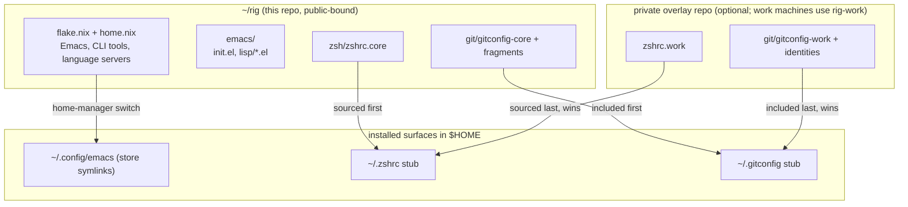
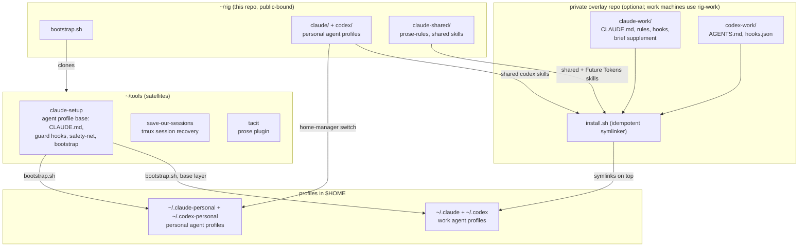

# rig

Personal machine setup, managed by Nix home-manager: Emacs, tmux, ghostty,
zsh, git, and Claude/Codex agent config. Reproducible across machines (macOS
and, in principle, Linux). The Emacs config is plain Elisp, so it works even
cloned without Nix. Nix pins the binaries, language servers, and CLI tools.

## Architecture

How this repo (`rig`), its satellites, and an optional private overlay repo
compose into one machine setup. The core repo is public-safe and defines the
overlay sockets (files sourced or included last); it references no overlay by
name. Work machines currently plug in one overlay, `rig-work`, which holds
everything employer-specific and always wins by loading last.

Two views, both flowing top to bottom from source repos to installed surfaces.

### Shell, git and Emacs config



### Agent profiles



Layering rules:

- The core repo never contains client names, internal hostnames, or secrets.
  The overlay repo holds all of those and is never public.
- Overlay config always loads after core config, so work settings win on work
  machines and their absence is harmless everywhere else.
- Agent profiles follow the same pattern as the shell: `claude-setup` installs
  the shared base into each profile dir, then the overlay's `install.sh`
  symlinks work-specific instructions and rules on top.
- Machine-local, uncommitted state (Emacs `~/.config/emacs-local/`, secrets in
  1Password) sits outside all three repos.

## What this repo manages

- `emacs/` - the full Emacs config (plain Elisp, symlinked to `~/.config/emacs`)
- `tmux/` - tmux config + MRU pickers (phase 1: files managed; the running
  server may still be an older binary until its own cutover)
- `ghostty/` - terminal config
- `zsh/` - `zshrc.core` (all shell config) + `zshrc.stub` (template for `~/.zshrc`)
- `git/` - `gitconfig-core` (identity, aliases), `gitconfig-dirs` (personal
  directory pins), `gitconfig-personal`, and `gitconfig.stub`
- `claude/`, `claude-shared/`, `codex/` - personal agent-CLI config, tracked as
  writable out-of-store symlinks (the CLIs rewrite these at runtime; changes
  show up as git diffs here)
- `bootstrap.sh` - fresh-machine setup
- `home.nix` - packages plus all the symlink wiring

### The stub pattern

`~/.zshrc` and `~/.gitconfig` are NOT symlinks: installers and tools append to
them, and a read-only store symlink would break that. Each is a tiny writable
stub that sources/includes the tracked file, then an optional work-overlay file
(`~/.zshrc.work`, `~/.gitconfig-work`) last, so a work machine's overlay wins.
Work machines get those overlay files from a separate private repo with its own
`install.sh`; personal machines simply don't have them.

### Shared agent policy

`agent-policy/common.md` and `claude-shared/prose-rules.md` hold shared policy.
`agent-policy/personal.md` supplies personal paths; `claude.md` and `codex.md`
contain host-specific guidance. `bin/render-agent-policy.py` composes these into
the checked-in personal `CLAUDE.md` and `AGENTS.md`. With `--work-repo <path>`,
it also renders work profiles using that private repo's `agent-policy/work.md`.
Generated files are complete instructions, so neither host needs to interpret
the other's include syntax. Edit the sources and rerender; `--check` detects drift.

`claude-shared/skills/` is the canonical shared skill library despite its
historical name. `agent-policy/skills.json` lists shared and host-specific
skills. Codex's source directory links to the shared bodies and adds its
orchestration skill. Explicit-only skills carry both Claude frontmatter and
Codex `agents/openai.yaml` policy. Larger skills route to optional references.

`bin/install-agent-skills.py` previews installation; `--apply` installs and
`--check` verifies it. Bootstrap invokes it after home-manager. The work
overlay supplies its own skill manifest and sources and invokes it with
`--work-repo`. Work integrations belong only in work profiles, not in the
globally discovered `~/.agents/skills`. Replaced links/directories and retired
global entries are moved to `~/.local/state/rig-skill-backups/<timestamp>/`,
preserving their home-relative paths. Unlisted entries are left alone.

The prose plugin is installed normally in each profile. Do not create aliases
to a versioned plugin-cache directory. All shared policy remains personal-safe;
work-specific tools and configuration stay in the private overlay. The overlay
may reference this repo (bootstrap pins it at `~/rig`), never the reverse.

Containment follows the satellite-tool model. Its engine, source contracts and
recovery implementation live independently; this repo provides only the
`rig-contained-source` maintenance wrapper and installation integration. Private
policy overlays and local state remain separate. See [containment integration](docs/contained.md).
No containment runtime or normal agent-command cutover is activated by this
wrapper.

Portability caveat: some tracked agent config (`claude/settings.json`,
`codex/hooks.json`) contains machine-absolute home paths; edit those when
setting up a machine with a different username.

Personal `codex/config.toml`, `claude/settings.json`, and `codex/hooks.json`
are defaults, not live runtime files. Home Manager copies/merges them into
local, owner-writable files in `~/.codex-personal` and `~/.claude-personal`.
Project trust, onboarding state, hook approvals, and generated environment
context stay local. Work profiles remain under the private overlay and AIX.

On later activations, `bin/sync-personal-agent-config.py` applies default
changes only where the local setting still matches its previous default.
Local additions, edits, and deletions win; arrays are treated as whole values.
To share a runtime preference across machines, edit the corresponding tracked
default deliberately. Previous defaults and recoverable pre-change copies live
under `~/.local/state/rig-agent-config/`. Migrating old repository symlinks
preserves their current contents before detaching them.

## Bootstrap a new machine

Requires Nix (with flakes) installed and permitted on the target machine.

```bash
git clone https://github.com/dabd/rig ~/rig
~/rig/bootstrap.sh
```

`bootstrap.sh` creates the `~/.zshrc` / `~/.gitconfig` stubs (only if absent),
clones satellite tools to `~/tools`, installs oh-my-zsh and its plugins, and
runs the home-manager switch. Idempotent; safe to re-run. The manual
equivalent of just the switch:

```bash
cd ~/rig
nix run home-manager/master -- switch --flake .#default --impure
```

## Layout

```
flake.nix / flake.lock   pinned inputs: nixpkgs, home-manager, emacs-overlay
home.nix                 packages and the config symlinks
bootstrap.sh             fresh-machine setup
zsh/ git/ tmux/ ghostty/ claude/ claude-shared/ codex/   (see above)
emacs/
  early-init.el          pre-frame tuning + Nix exec-path for GUI .app launches
  init.el                elpaca bootstrap + module loader
  lisp/
    ui.el                modus-vivendi, which-key, font
    completion.el        vertico + orderless + marginalia + consult + corfu
    editing.el           defaults, multiple-cursors, duplicate-line
    projects.el          project.el, treesit-auto, dired (see naming note below)
    lsp.el               eglot + dape (Scala / Metals)
    git.el               magit + forge (github.com; enterprise hosts loaded locally)
    llm.el               gptel; backend chosen per-machine (work: AWS Bedrock)
```

> The flake ships one machine-agnostic entry, `default`. It reads your username
> from `$USER` and the platform from `builtins.currentSystem` at switch time, so
> nothing machine-specific is committed and the same command works on every
> machine. Reading the environment makes evaluation impure, hence `--impure`;
> `flake.lock` still pins the toolchain, so what gets installed stays
> reproducible. `mkHome` derives the home directory from the OS, so one entry
> covers macOS and Linux. First switch compiles or fetches `emacs-macport` (can
> be tens of minutes if not cached); later switches are fast.

## Launching Emacs (macOS)

Launch the **GUI via the `.app` bundle** so the window gets proper macOS keyboard
focus (Launch Services). Running the bare binary or a launchd-daemon GUI frame
does *not* receive focus: the window appears but keystrokes leak to the
terminal (a known macOS activation-policy behavior, worse on macOS 15.x). So:

```bash
open -a ~/.nix-profile/Applications/Emacs.app   # GUI (primary use)
emacs -nw                                       # quick terminal Emacs
```

Convenience shell functions (`ec` / `et`, defined in `zsh/zshrc.core`):

```bash
ec() { open -a "$HOME/.nix-profile/Applications/Emacs.app" "$@"; }  # GUI, optional files
et() { "$HOME/.nix-profile/bin/emacs" -nw "$@"; }                   # terminal frame
```

> No Emacs daemon is used. The `emacs-macport` daemon under launchd cannot serve
> a focus-correct GUI frame on macOS, so this setup launches the GUI app directly
> instead (it starts fast). `early-init.el` adds the Nix profile to `exec-path`,
> so the app finds `metals`/`rg`/`curl` even though a GUI app doesn't inherit the
> shell PATH.

## Machine-local files (NOT in this repo)

Two files hold per-machine or work-specific configuration. They live **outside**
this repo, are **never committed**, and are created by hand once per machine.
`~/.config/emacs` is fully Nix-owned (read-only store symlinks), so these live in
`~/.config/emacs-local/` instead. Both are loaded with a NOERROR guard, so a
machine without them still starts cleanly.

### `~/.config/emacs-local/local.el`: enterprise git/forge hosts

Registers enterprise GitHub hosts with Forge. Kept out of this public repo
because the hostnames are work infrastructure. Example:

```elisp
;;; local.el --- machine-local: enterprise forge hosts -*- lexical-binding: t; -*-
(with-eval-after-load 'forge
  (dolist (h '(("github.example-corp.com" "github.example-corp.com/api/v3"
                "github.example-corp.com" "github.example-corp.com")))
    (add-to-list 'forge-alist h)))
(provide 'local)
```

### `~/.config/emacs-local/llm-local.el`: gptel backend

Selects the LLM backend for this machine. `llm.el` ships no backend, so gptel is
inert until this file provides one. On a work laptop with AWS Bedrock:

```elisp
;;; llm-local.el --- machine-local gptel backend -*- lexical-binding: t; -*-
(with-eval-after-load 'gptel
  (require 'gptel-bedrock)
  (setq gptel-backend
        (gptel-make-bedrock "AWS-Bedrock"
          :region "us-east-1"
          :model-region 'us
          :stream t
          :aws-profile "your-bedrock-profile")
        gptel-model 'claude-sonnet-4-20250514))
(provide 'llm-local)
```

Bedrock auth uses the AWS profile (SigV4), no API key. It needs a valid AWS
session (e.g. `aws sso login`) and curl >= 8.9 (provided by `home.nix`; macOS
ships 8.7). A personal machine could instead point gptel at any other backend
(an API key via auth-source, a local Ollama, etc.).

## Secrets

No secrets are committed. API access is per-machine: work LLM uses AWS Bedrock
via an AWS profile (above); GitHub/Forge tokens resolve through auth-source
(e.g. `~/.authinfo.gpg` or the 1Password `op` CLI), never stored in the repo.

## Language servers

`lsp.el` uses the built-in `eglot`. The primary language is **Scala** via
**Metals** (`metals` is in `home.nix`; `scala-ts-mode` is the major mode, and
eglot is mapped to launch Metals for it). On first open of a `.scala` file,
treesit-auto prompts to install the Scala tree-sitter grammar; accept it.
Metals downloads and indexes its build server on first attach, so the first
connection in a project is slow. Add more languages by adding the server to
`home.nix` and a `-ts-mode` hook in `lsp.el`.

## Naming note: `projects.el`

The module is `projects.el` providing feature `projects` (not `project`). Emacs
has a built-in `project` feature; a `lisp/project.el` that also configures the
built-in causes a recursive-`require` clash at startup. The rename avoids it;
the module still configures the built-in `project` package internally.

## macOS GUI escape hatch

The normal GUI entry point is the app bundle (see "Launching Emacs" above). A
bare `emacs &` may start without a window, and a launchd-daemon GUI frame doesn't
get keyboard focus:

```bash
open -a ~/.nix-profile/Applications/Emacs.app
```

If an `emacs-macport` build ever breaks on a new macOS release, temporarily
install the Homebrew cask (`brew install --cask emacs-app`) and put
`/opt/homebrew/bin` ahead of the Nix profile on PATH until the overlay catches up.

## Work / personal git

`~/.gitconfig` is the stub described above: it includes the tracked
`git/gitconfig-core` (personal identity, aliases), then an optional
`~/.gitconfig-work` overlay, then `git/gitconfig-dirs` (personal-directory
`includeIf` pins, loaded last so they win in personal dirs). Magit inherits all
of this by shelling out to `git`, so Emacs needs no identity config. Enterprise
hosts and work emails stay out of this repo, in the work overlay.
